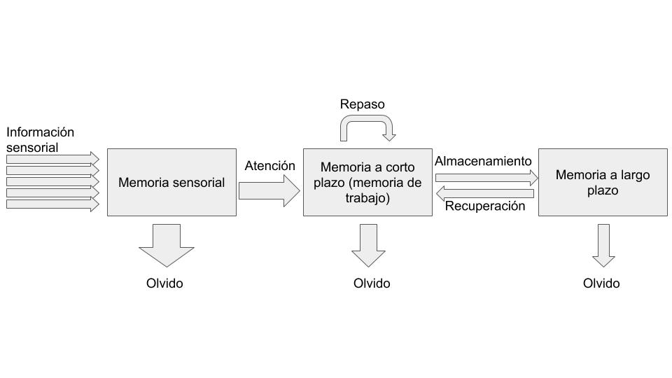

# Conocemos la materia prima con la que trabajamos: el cerebro de nuestros alumnos {#conocemos-la-materia-prima-con-la-que-trabajamos-el-cerebro-de-nuestros-alumnos}

Un primer paso para lograr ese aprendizaje significativo es que conozcamos muy bien cómo funciona la “caja negra” de nuestros estudiantes, es decir, su cerebro: cómo aprende, cómo retiene lo aprendido y cómo podemos lograr que tengan motivación para todo esto.

Aunque no es sencillo, voy a intentar explicar brevemente esto que acabo de mencionar. El objetivo no es aburrirte con teorías y modelos, sino que puedas juzgar por tí mismo en el futuro si una nueva metodología docente puede ser efectiva en base a lo que sabemos del aprendizaje humano. De hecho, probablemente el problema hoy en día no radique en que no disponemos de ninguna alternativa a la famosa clase magistral, sino que disponemos de tantas que no sabemos por qué decidirnos (ver apartado “[Aprender haciendo](aprender_haciendo/README.md)”). Espero que con estos básicos conocimientos sobre el funcionamiento de la mente humana pueda ayudarte a decidir en el futuro.

Vamos a pensar en una situación de clase habitual. Estás intentando dar una instrucción a tus estudiantes, como por ejemplo explicar qué tienen que hacer en la práctica de hoy. Para que como poco recuerden esta instrucción tienen que pasar muchas cosas, te lo contaré de forma resumida (puedes ver una representación esquemática en la Figura 2).

En primer lugar la información tiene que penetrar por sus sentidos y llegar a su memoria sensorial. Este almacén de memoria es ilimitado pero de muy breve duración, su información se desvanece en unos milisegundos. Puesto que la información que nos llega desde la memoria sensorial es ilimitada, es necesario de alguna manera filtrar esa información para poder trabajar con ella. Ahí es donde entran en juego los procesos atencionales. Por ejemplo, a través de nuestra atención selectiva atienden a la información relevante para la tarea, ignorando la que no lo es (¡o eso es lo que pretendemos!). Esta información pasa a su vez a la memoria a corto plazo o memoria de trabajo. Como su nombre indica, la memoria de trabajo es un almacén de memoria de capacidad limitada donde retenemos y trabajamos activamente con la información que acaba de filtrar nuestra atención selectiva; también planificamos estrategias para solucionar la tarea que nos han encomendado y las ponemos a prueba. Para que lo entiendas mejor, los contenidos de nuestro pensamiento son al fin y al cabo los contenidos de nuestra memoria de trabajo.

No todos los contenidos de nuestra memoria de trabajo están destinados a almacenarse de forma permanente: muchos de ellos se desvanecen rápidamente. No obstante, otros contenidos, aquellos que se han procesado en profundidad, pasarán a nuestra memoria a largo plazo. La memoria a largo plazo es un almacén de contenido ilimitado donde la información se almacenan durante un largo periodo de tiempo (incluso años). Es importante mencionar que la memoria de trabajo y la memoria a largo plazo se comunican de forma bidireccional: cuando la memoria de trabajo necesita un dato para resolver un problema se la pide a la memoria a largo plazo. Esta comunicación bidireccional es fundamental para tenga lugar nuestro tan ansiado aprendizaje significativo, de acuerdo con autores como (Mayer, 2004).

Recordemos a nuestro alumno intentando recordar las instrucciones para solucionar la práctica que le estamos dando verbalmente: nuestra voz, a la vez que todos los otros estímulos que hay presentes en la clase, están entrando a través de sus sentidos en la memoria sensorial. Si está atento y su atención selectiva está funcionando bien, atenderá a nuestra voz ignorando todo lo que ocurre alrededor. De este modo, los contenidos que le estamos transmitiendo verbalmente llegarán a su memoria de trabajo. Recordemos que la memoria de trabajo tiene una capacidad limitada; si no le estás saturando de información, la memoria de trabajo retendrá lo que estás diciendo, y si el alumno pone en marcha las estrategias adecuadas (por ejemplo, hacer un repaso mental de lo que estás diciendo y relacionándolo con información de la memoria a largo plazo, por ejemplo, lo que has pedido en otras prácticas), la información no se desvanecerá y pasará a la memoria a largo plazo.

Figura 2\. Modelo de procesamiento de la información (Aktinson y Shifrin, 1986).

¿Y qué tiene que ver esto con el aprendizaje significativo? Como mencionábamos anteriormente, para autores como Mayer (2004), el aprendizaje significativo se produce cuando se produce ese intercambio de información entre la memoria de trabajo y la memoria a largo plazo. Ese diálogo se genera cuando por ejemplo, nuestro estudiante relaciona lo que ya sabe con lo nuevo a aprender y lo sitúa en el contexto global de la asignatura. De ahí deducimos nuestras primeras mini reglas para lograr un aprendizaje significativo:

| Regla nº 1\. Explica el objetivo general de la clase/tema/proyecto y relacionarlo con el contexto global de la asignatura |
| --- |

| Regla nº2\. Refresca o activa los conocimientos previos del alumno. |
| --- |

Por ejemplo, probablemente todos nuestros alumnos vengan a clase de Medios de Medios informáticos I con una idea, aunque sea intuitiva, de lo que es un vector. Si tienes suerte y tu clase es participativa, podemos refrescar o hacer explícito ese conocimiento que tiene nuestro alumno lanzando unas cuantas preguntas al inicio de clase[^2]. En otras palabras, estaremos trayendo información de su memoria a largo plazo a su memoria a corto plazo. Si además le situamos este conocimiento en el contexto global de la asignatura estaremos situando ese conocimiento en una estructura global, lo que favorecerá su recuerdo..

Otras buenas ideas para mejorar la retención de conocimientos en la memoria a largo plazo son: hacer que los alumnos se expliquen los contenidos entre ellos (ver más adelante el apartado “T[Tutoría entre iguales](aprender_haciendo/tutoria_entre_iguales.md)”), repasar lo aprendido de forma periódica, realizar pruebas de evaluación frecuentes (retomaremos este punto más adelante en el apartado [Añadimos la evaluación a la receta](anadimos_la_evaluacion_a_la_receta.md)) o no agrupar conceptos o problemas similares, emparejar conceptos con imágenes, tal y como nos muestra este [vídeo](https://www.google.com/url?q=https://www.youtube.com/watch?v%3DIq47-x2EYrE%26feature%3Dyoutu.be&sa=D&ust=1572945444149000) en inglés de la fundación Edutopia.

[^2]: