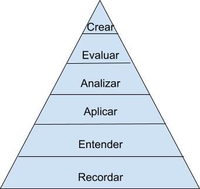

# ¿Qué pretendemos lograr en nuestro alumnado? {#qu-pretendemos-lograr-en-nuestros-estudiantes}

Párate a reflexionar brevemente 

**¿Qué quiero lograr en mis clases? **

Seguramente una de las primeras cosas que se te ha venido a la mente es “que aprendan”.

 Vayamos un poco más allá: seguramente no queremos que simplemente recuerden datos \(en el mejor de los casos\), además queremos que entiendan la información que se les está presentando, que sean capaces de aplicar lo aprendido, y que incluso vayan un poco más allá y analicen y evalúen una determinada teoría o producto en función de lo que han aprendido. 

Y, por supuesto, en ámbitos aplicados como son los del arte y diseño, queremos que den un paso más y sean capaces de crear un producto original. Es decir, no sólo quiero que mi alumnado conozcan la teoría del color, quiero que la apliquen adecuadamente en el diseño un buen cartel publicitario. En definitiva, queremos que el alumnado **alcance la posición más alta de la taxonomía de Bloom **que puedes ver en Figura 1.

.

_Figura 1. Taxonomía de Bloom revisada \(Mayer, 2002\)._

Como podemos imaginar, cada nivel de la taxonomía se construye sobre los inferiores \(por ejemplo, difícilmente podemos evaluar un producto si no somos capaces de analizarlo\), por lo que no hay ningún nivel del que podamos prescindir. No obstante, de acuerdo con Mayer \(2002\), para que se produzca la transferencia del aprendizaje, es decir, para que el alumnado use lo que ha aprendido para resolver nuevos problemas, responder nuevas cuestiones o facilitar el aprendizaje de nuevos contenidos de la materia, es necesario trascender el primer nivel, el más puramente memorístico. y promover en el mismo un **aprendizaje significativo**[^1].

Este **aprendizaje significativo se logra** cuando el alumnado realiza un procesamiento activo a nivel cognitivo, lo que implica, entre otras cosas**, prestar atención a la información relevante, organizar esta información en una representación coherente e integrar esta información con el conocimiento ya existente** \(Mayer, 2002\).

Todos sabemos que en educación no hay recetas universales \(¡ojalá fuese así!\). Y aunque las hubiese, siguiendo el símil de la cocina, somos conscientes que a cocinar se aprende cocinando. No obstante, sí que hay una serie de cuestiones que nos conviene saber para poder para aprender a elaborar esa receta personal que logrará un aprendizaje significativo en nuestros estudiantes.

[^1]:

